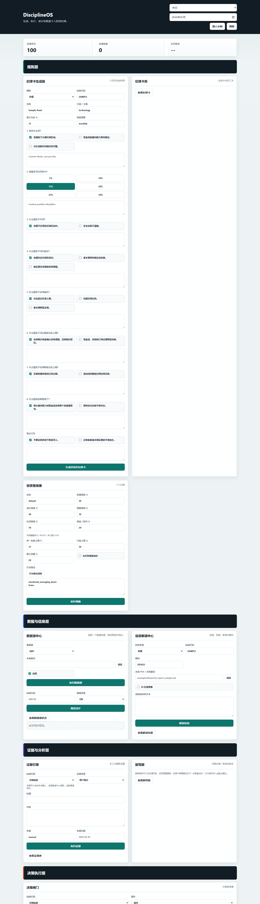

# DisciplineOS

DisciplineOS 是一个本地优先的个人投资纪律系统。它不荐股、不预测价格、不替用户交易，而是帮助投资者把“事前写下的纪律”落实到数据、证据、仓位、决策审查、记录和复盘流程里。

一句话概括：**DisciplineOS 不回答“这只股票会不会涨”，它回答“这次操作是否符合我事先定义的纪律”。**



## 当前定位

本项目目前是一个可运行的本地 Web 应用和 Python 后端原型，适合用于个人投资纪律管理、交易前自查、证据归档和月度复盘。

它不是：

- 投资顾问系统
- 荐股工具
- 自动交易系统
- 收益预测系统
- 目标价生成器

## 核心功能

- 本地 Web UI：默认运行在 `http://127.0.0.1:8765/`
- 中英文界面切换
- 纪律卡生成器
- 纪律卡库
- 投资者画像
- 数据源中心
- 信息解读中心
- 证据引擎
- 决策闸门
- 副驾驶
- 持仓簿
- 仓位护栏
- 交易流水
- 决策历史
- 违规台账
- 月度复盘
- 系统设置、AI 配置、备份与恢复、系统状态检查

## 七层结构

当前 UI 按以下七层组织：

1. 规则层
   - 纪律卡生成器
   - 纪律卡库
   - 投资者画像

2. 数据与信息层
   - 数据源中心
   - 信息解读中心

3. 证据与分析层
   - 证据引擎
   - 财报证据保存区
   - 副驾驶

4. 决策执行层
   - 决策闸门

5. 持仓与风控层
   - 持仓簿
   - 当前持仓
   - 仓位护栏

6. 记录与复盘层
   - 交易流水
   - 决策历史
   - 违规台账
   - 月度复盘

7. 系统支撑层
   - 系统设置
   - AI 配置
   - 本地备份与恢复
   - 系统状态

页面顶部的纪律评分、决策检查次数、本月状态是全局摘要，不属于某个单独业务层。

## 纪律卡生成器

纪律卡生成器有 6 个问题+ 禁止行为。

基础字段：

- 标的代码
- 标的名称
- 行业 / 主题
- 最大仓位比例
- 复盘周期

8 个编号问题：

1. 为什么买？
2. 我最多可以买多少？
3. 什么条件下不买？
4. 什么情况下可以加仓？
5. 什么情况下必须减仓？
6. 什么情况下可以提高仓位上限？
7. 什么情况下必须降低仓位上限？
8. 什么情况证明我错了？

额外纪律项：

- 禁止行为

生成后的纪律卡会保存到纪律卡库，并在决策闸门、证据引擎和复盘流程中被引用。

## 投资者画像

投资者画像用于定义全局约束：

- 名称
- 价值风格占比
- 成长风格占比
- 周期风格占比
- 红利风格占比
- 现金 / 防守仓位占比
- 单一标的仓位上限
- 行业仓位上限
- 最大回撤容忍
- 是否允许财报前加仓
- 行为弱点


## 数据源中心

当前支持的数据源类型：

- QMT
- TuShare
- AkShare
- CSV
- Excel
- 手动数据

可同步的数据类型：

- 日 K
- 5 分钟 K
- 成交量
- 财务指标
- 持仓
- 交易流水

实现状态：

- CSV / Excel：已实现本地文件导入和证据转换。
- TuShare：已接入可选连接器，需要安装 `tushare` 并配置 Token。
- AkShare：已接入可选连接器，需要安装 `akshare`。
- QMT：当前保存本地路径和状态，但真实 QMT / xtquant 连接器尚未完成。

为避免一次同步全市场数据，数据源同步支持填写个股代码后按标的同步。

数据源中心 UI 可以直接配置基础同步策略：

- `min_interval_seconds`：同一数据源 / 数据类型 / 标的两次确认同步之间的最小间隔。
- `max_syncs_per_day`：同一数据源 / 数据类型每天允许的成功同步次数。
- `max_retries`：连接器返回临时错误时的自动重试次数，上限为 5。

行情数据弹窗支持按标的代码、数据类型和数量上限筛选，并提供基础走势图和字段值查看。

## 信息解读中心

信息解读中心用于处理：

- 财报
- 研报
- 公告 / 新闻
- 市场事件

输入方式：

- 选择本地 PDF / Markdown / TXT 文件
- 粘贴原始文本
- 可选启用 AI 在线搜索意图

当前实现：

- PDF 文本提取依赖 `pypdf`
- Markdown / TXT 文本可直接读取
- DOCX 支持基础正文解析；旧版 `.doc` 暂不支持
- 未启用 AI 时使用本地规则摘要
- 启用 AI 后调用 OpenAI-compatible API，并经过合规护栏处理

解读结果可以保存为证据，也可以生成纪律卡建议。

## 证据引擎

证据可以来自：

- 手动录入
- 信息解读中心
- 数据源同步

证据字段包括：

- 标的代码
- 证据类型
- 证据标题
- 证据内容
- 证据来源
- 来源日期

证据库通过弹窗查看，不在主页展开全部内容。

## 决策闸门

决策闸门用于交易前审查。

输入项：

- 标的代码
- 操作类型：买入、加仓、减仓、卖出
- 金额
- 当前情绪
- 操作理由
- 手动证据
- 已保存证据项
- 是否财报前
- 投资逻辑是否变化
- 是否自动计算操作前后仓位

审查输出包括：

- `PASS`
- `WARN`
- `BLOCKED`
- `EVIDENCE_REQUIRED`
- `REVIEW_REQUIRED`

## 规则引擎

当前规则覆盖：

- 单一标的仓位上限
- 买入 / 加仓必须有证据
- 情绪化补仓
- 财报前无计划加仓
- FOMO
- 报复性交易
- 投资逻辑漂移
- 投资风格漂移
- 估值约束
- 重大操作后复盘要求

## 持仓与风控

持仓簿字段：

- 标的代码
- 名称
- 资产类型
- 市场
- 行业
- 主题
- 币种
- 数量
- 成本价
- 当前价

仓位护栏会计算：

- 单一标的暴露
- 行业暴露
- 主题暴露
- 市场暴露
- 币种暴露

当暴露接近或超过投资者画像中的上限时，系统会提示风险。

## 记录与复盘

系统会记录：

- 交易流水
- 决策历史
- 规则结果
- 违规台账
- 月度复盘快照
- 复盘报告

月度复盘包括：

- 纪律评分
- PASS 比例
- 违规类型统计
- 违规权重
- 归因分析
- 下月禁止行为
- 规则修订建议
- 快照对比
- Markdown 报告导出

## 副驾驶

副驾驶是纪律辅助层，不是荐股助手。

它可以帮助整理：

- 纪律一致性摘要
- 投资逻辑漂移提醒
- 纪律卡修订草稿
- 下次复盘动作

它不会输出：

- 买入建议
- 卖出建议
- 目标价
- 确定性收益判断

## 安装与运行

要求：

- Python 3.11+

创建虚拟环境：

```powershell
python -m venv .venv
.\.venv\Scripts\Activate.ps1
python -m pip install -e ".[dev]"
```

如果需要 TuShare / AkShare 数据源：

```powershell
python -m pip install -e ".[dev,data]"
```

启动 Web UI：

```powershell
disciplineos web --data-dir .\data
```

打开：

```text
http://127.0.0.1:8765/
```

如果没有安装入口命令，也可以直接运行源码：

```powershell
$env:PYTHONPATH = "src"
python -m disciplineos.cli web --data-dir .\data
```

## 常用命令

加载示例数据：

```powershell
disciplineos demo --data-dir .\data
```

审查一个决策 JSON：

```powershell
disciplineos check .\examples\sample_decision.json --data-dir .\data
```

生成月度复盘：

```powershell
disciplineos review --month 2026-05 --data-dir .\data
```

运行测试：

```powershell
.\.venv\Scripts\pytest.exe -q
```

源码编译检查：

```powershell
.\.venv\Scripts\python.exe -m compileall -q .\src
```

前端 JavaScript 语法检查：

```powershell
node --check .\src\disciplineos\static\app.js
```

## 数据目录

所有本地运行数据默认保存在启动时指定的 `--data-dir` 中，例如：

```text
data/
```

该目录可能包含：

- 本地数据库
- 纪律卡
- 持仓
- 交易流水
- 证据
- 决策历史
- 违规台账
- AI 配置
- 备份文件

因此 `data/` 已被 `.gitignore` 排除，不应上传到公开仓库。

## 示例文件

```text
examples/
  financial_report_sample.md
  positions.csv
  sample_decision.json
  trades.csv
```

持仓 CSV 字段：

```csv
symbol,name,asset_type,market,sector,theme,currency,quantity,cost_price,current_price
```

常见中文表头也可以识别，例如：

```csv
股票代码,股票名称,资产类型,市场,行业,主题,币种,持仓数量,成本价,当前价
```

交易流水 CSV 字段：

```csv
symbol,action,quantity,price,amount,fee,traded_at,note
```

常见中文表头也可以识别，例如：

```csv
证券代码,操作,数量,成交价,成交金额,手续费,成交时间,备注
```

`action` 支持：

- `buy`
- `add`
- `reduce`
- `sell`
- `买入`
- `加仓`
- `减仓`
- `卖出`
- `清仓`

行情 / 财务 CSV 字段也支持常见别名，例如 `股票代码`、`日期`、`交易时间`、`收盘价`、`涨跌幅`、`成交量`、`报告期`、`指标`、`数值`。数字字段支持简单清洗，例如 `10,000` 和 `2.1%`。

## 项目结构

```text
src/disciplineos/
  adapters.py              CSV / Excel 导入
  ai_analysis.py           可选 AI 信息解读
  ai_guardrails.py         AI 输出合规护栏
  card_generator.py        纪律卡生成器与模板
  cli.py                   命令行入口
  connectors.py            CSV / Excel / TuShare / AkShare 连接器
  copilot.py               纪律副驾驶
  financial_report.py      财报 / 研报 / 新闻材料解读
  models.py                数据模型
  position_guard.py        仓位护栏
  repositories.py          仓储封装
  review_engine.py         月度复盘
  rules.py                 规则引擎
  scoring.py               纪律评分
  services.py              应用服务层
  storage.py               SQLite + JSON 兼容存储
  violation_catalog.py     违规类型
  web.py                   本地 Web API
  static/
    index.html
    app.js
    styles.css
```

## 当前限制

当前版本已经可以本地运行，但仍是个人本地纪律工作台和工程原型，不是生产级投资平台。下面列出的是当前没有完成、只完成框架，或需要用户明确理解边界的部分。

### 数据源与行情

- QMT 真实连接器尚未完成。当前只能保存本地 QMT 路径并显示状态，还没有接入 `xtquant` / QMT 实盘终端读取行情、持仓或成交。
- TuShare / AkShare 已有可选连接器框架，但依赖本机安装对应 Python 包、Token / 网络环境和第三方接口可用性；真实市场环境下仍需要逐项验收。
- TuShare / AkShare 当前主要把日 K、5 分钟 K、成交量、财务指标转换为证据项，不是完整行情数据库。
- Eastmoney、Yahoo Finance、自定义 API 当前是预留配置项，尚未接入可执行连接器。
- 数据源同步支持按标的代码过滤、最近同步状态、失败重试、最小同步间隔、每日同步配额和 UI 策略配置；但尚未针对不同外部接口做精细化限流算法。
- 当前已有基础时序行情存储、字段查看和行情走势图；但尚未完成复权处理、交易日历、多市场统一代码体系和专业级行情分析组件。
- CSV / Excel 导入支持常见中英文表头别名、字段映射展示和基础数字清洗；但尚未提供可视化字段映射编辑器和复杂异常处理。
- 财报、研报、新闻、公告不会自动从交易所、券商或资讯平台批量抓取。

### 文档与信息解读

- PDF / Markdown / TXT / DOCX 相对可用；旧版 `.doc` 二进制文档尚未解析，需要先另存为 DOCX、PDF、Markdown 或 TXT。
- AI 在线搜索不是应用内置浏览器搜索；当前只是把“需要在线搜索”的意图交给配置的 AI Provider，是否真的联网取决于该 Provider。
- 信息解读结果是证据摘要和纪律建议，不等于完整财务建模、估值建模、研报数据库或新闻数据库。
- 超长材料的分段处理、引用定位、原文页码回溯和多文件合并分析仍需增强。
- 信息解读中心不会保证 PDF 表格、扫描件 OCR、图片、复杂脚注和会计科目全部解析准确。
- AI 生成的建议会落到纪律卡建议里，但不会自动修改用户已保存的纪律卡，需要用户确认。

### AI 与安全

- AI 接入目前面向 OpenAI-compatible Chat Completions 接口，尚未针对不同 Provider 做完整适配和验证。
- 当前没有内置 AI 模型，也没有离线大模型；启用 AI 前需要用户自己配置可用的 API URL、模型名和 Token。
- AI Token、TuShare Token 等敏感配置当前保存在本地数据库中，尚未接入系统密钥库或加密存储。
- AI 输出有合规护栏，但无法保证第三方模型永远不产生不当内容；最终状态仍应以规则引擎为准。
- 没有内置模型调用成本统计、额度控制、请求队列和失败重试策略。
- 当前没有登录、二次认证、密钥权限隔离和敏感字段脱敏展示。

### 决策、交易与风控

- 系统只做纪律审查，不接券商交易接口，不自动下单，也不替用户执行买卖。
- 决策闸门依赖用户选择纪律卡、填写操作和证据；如果输入不完整，系统只能做有限检查。
- 规则引擎覆盖的是当前内置纪律规则，不是完整风控系统、法律合规系统或投资顾问系统；更多规则仍需要继续扩展。
- 持仓簿支持手动维护、导入，以及由交易流水基础归集生成当前持仓。
- 交易流水可以按移动加权成本反推数量、成本价、现金流、费用、已实现盈亏、未实现盈亏和基础现金账户摘要；但尚未完整支持独立资金流水、税费明细、分红、融资融券和多币种汇兑。
- 仓位护栏提供单标的、行业、主题、市场、币种暴露提示，但没有组合优化、VaR、压力测试或回撤归因模型。
- 同步日 K 或 5 分钟 K 后，可用最新收盘价刷新持仓现价；但尚未提供后台定时行情轮询、实时推送和自动风险预警任务。
- 纪律评分和月度复盘偏行为与规则审计，不是收益绩效归因系统。
- 当前没有回测模块，也不评估某套纪律规则的历史收益表现。
- 副驾驶用于摘要、提醒和纪律修订草稿，不生成目标价、收益承诺或确定性买卖建议。

### 存储、权限与部署

- 当前定位是本地单人使用，没有登录、多用户权限、角色控制和团队协作。
- 默认使用本地 SQLite + JSON 兼容写入；设置里的 PostgreSQL 仍属于未来选项，后端尚未真正接入。
- 本地备份/恢复可用，但没有云同步、跨设备同步、自动备份计划和备份加密。
- 没有生产部署方案、HTTPS、反向代理配置、服务守护进程或安装器。
- 没有数据迁移版本管理工具，长期升级时仍需要补正式 migration 机制。
- 本地数据库、备份包和导入文件可能包含真实交易、持仓、Token、本地路径等敏感信息，公开上传前必须排除。

### 前端与工程化

- Web UI 已可用，但仍是本地工作台形态，移动端适配、无障碍、快捷键和复杂交互还不完整。
- 中英文切换覆盖主要界面，但动态文本和少数历史文案仍可能存在遗漏。
- 目前有后端单元测试，但缺少浏览器端 E2E 测试、视觉回归测试和真实数据源集成测试。
- 尚未配置 GitHub Actions、自动发布、打包构建和版本发布流程。
- 代码中 `services.py` 仍偏大，后续需要继续拆分 DataSource、Decision、Review、Backup 等服务边界。
- 当前发布方式仍以源码运行为主，没有 Windows 桌面安装包、自动更新和版本迁移向导。


## 合规边界

DisciplineOS 的输出只能作为个人纪律检查和复盘参考，不构成投资建议。任何买入、卖出、加仓、减仓决定都应由用户自行负责。
