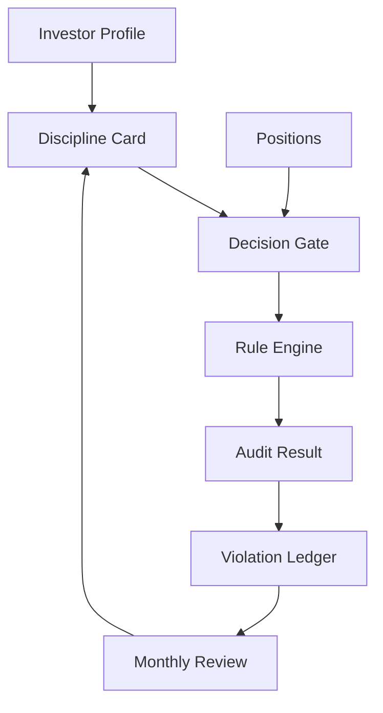

# System Architecture

DisciplineOS follows a six-layer architecture:

1. Presentation Layer: CLI, Web UI, reports, agent chat.
2. AI Copilot Layer: explanation and drafting only.
3. Review & Audit Layer: violation ledger, discipline score, attribution.
4. Discipline Engine Layer: rule engine, decision gate, position guard.
5. Unified Investment Model: profile, asset, position, trade, decision, card.
6. Data Adapter Layer: manual input, CSV, broker export, public APIs.

The core system does not depend on market data or broker APIs. Adapters normalize external data into the unified model before the engine evaluates decisions.

